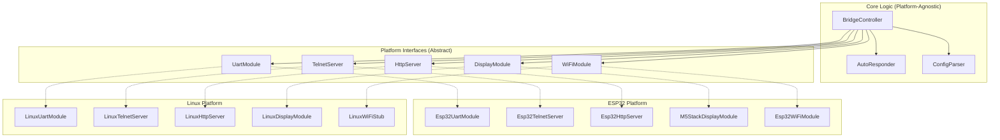
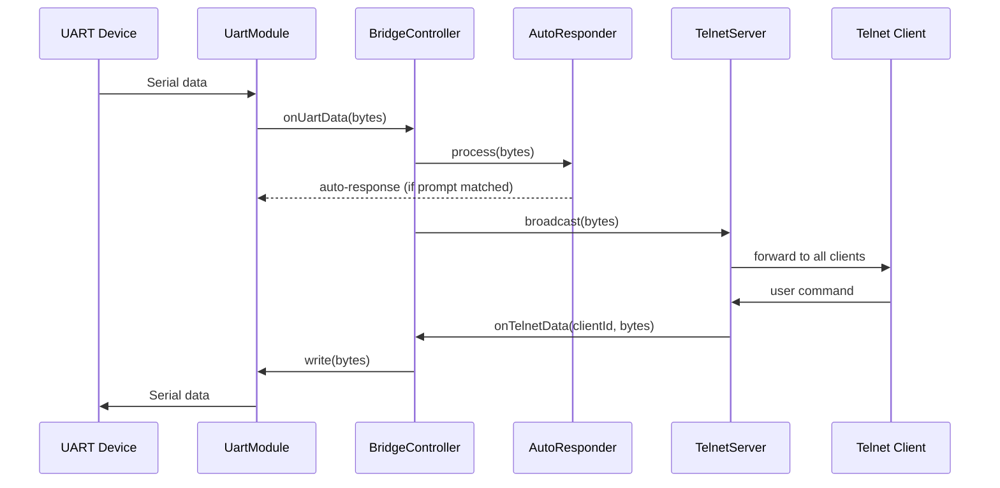
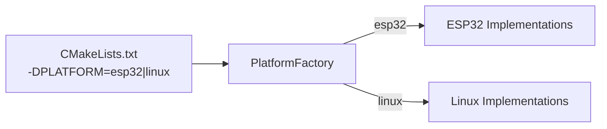

# Design Document: UART-Telnet Bridge

## Overview

The UART-Telnet Bridge is a cross-platform C++ application that connects a UART-attached device to remote operators via Telnet and HTTP. It forwards UART output to Telnet clients in real time, relays Telnet input to the UART device, automatically responds to known prompts (login sequences, etc.), and exposes an HTTP API for runtime configuration. The application targets ESP32 (M5 Stack) and Linux platforms, with an interface-based architecture that allows adding new platforms without modifying core logic.

The design prioritizes:
- Clean separation between platform-agnostic core logic and platform-specific I/O
- Testability via dependency injection of all platform interfaces
- Low-latency data forwarding (UART ↔ Telnet within 50ms)
- Runtime reconfigurability of auto-responder rules via HTTP

## Architecture

### High-Level Architecture



### Data Flow



### Platform Selection

Platform-specific implementations are selected at compile time. A `PlatformFactory` maps a platform identifier (e.g., `esp32`, `linux`) to concrete implementations of each interface. The build system defines the platform identifier, and the factory instantiates the correct set of modules.



## Components and Interfaces

### Platform Interfaces

Each interface is a pure abstract C++ class. Platform implementations inherit from these and provide concrete behavior.

#### UartModule

```cpp
/**
 * @brief Abstract interface for UART communication.
 *
 * Provides a platform-independent contract for opening, reading from,
 * and writing to a hardware UART port. Platform-specific implementations
 * (e.g., Esp32UartModule, LinuxUartModule) inherit from this class.
 */
class UartModule {
public:
    virtual ~UartModule() = default;

    /**
     * @brief Open the UART port with the given configuration.
     * @param config UART configuration (port name, baud rate, data bits, parity, stop bits).
     * @return true if the port was opened successfully, false on error.
     * @pre @p config contains valid portName, baudRate, dataBits, parity, stopBits.
     * @post Port is open and ready for read/write, or an error is reported.
     */
    virtual bool open(const UartConfig& config) = 0;

    /**
     * @brief Close the UART port and release associated resources.
     */
    virtual void close() = 0;

    /**
     * @brief Write bytes to the UART port.
     * @param data Pointer to the byte buffer to transmit.
     * @param length Number of bytes to write.
     * @return Number of bytes written, or -1 on error.
     * @pre Port is open (isOpen() returns true).
     * @note Bytes are sent in the order provided.
     */
    virtual int write(const uint8_t* data, size_t length) = 0;

    /**
     * @brief Register a callback invoked when data is received from UART.
     * @param callback Function receiving a pointer to received data and its length.
     * @note Data must be delivered to the callback within 50ms of hardware reception.
     */
    virtual void setOnDataCallback(std::function<void(const uint8_t*, size_t)> callback) = 0;

    /**
     * @brief Check whether the port is currently open and operational.
     * @return true if the port is open, false otherwise.
     */
    virtual bool isOpen() const = 0;

    /**
     * @brief Attempt to reopen the port after a connection loss.
     * @return true if the port was reopened successfully, false on error.
     */
    virtual bool reopen() = 0;
};
```

#### TelnetServer

```cpp
/**
 * @brief Abstract interface for the Telnet server.
 *
 * Provides a platform-independent contract for accepting Telnet connections,
 * broadcasting UART data to clients, and receiving commands from clients.
 */
class TelnetServer {
public:
    virtual ~TelnetServer() = default;

    /**
     * @brief Start listening for incoming TCP connections.
     * @param port TCP port number to listen on.
     * @return true if the server started successfully, false if the port is in use.
     * @post Server accepts incoming TCP connections on @p port.
     */
    virtual bool start(uint16_t port) = 0;

    /**
     * @brief Stop the server and disconnect all connected clients.
     */
    virtual void stop() = 0;

    /**
     * @brief Broadcast data to all connected Telnet clients.
     * @param data Pointer to the byte buffer to send.
     * @param length Number of bytes to broadcast.
     */
    virtual void broadcast(const uint8_t* data, size_t length) = 0;

    /**
     * @brief Register a callback invoked when a connected client sends data.
     * @param callback Function receiving the client ID, data pointer, and data length.
     */
    virtual void setOnClientDataCallback(
        std::function<void(int clientId, const uint8_t*, size_t)> callback) = 0;

    /**
     * @brief Register a callback invoked when a client connects or disconnects.
     * @param callback Function receiving the client ID and a boolean (true = connected, false = disconnected).
     */
    virtual void setOnClientEventCallback(
        std::function<void(int clientId, bool connected)> callback) = 0;

    /**
     * @brief Get the number of currently connected clients.
     * @return Number of active Telnet client connections.
     */
    virtual int clientCount() const = 0;
};
```

#### HttpServer

```cpp
/**
 * @brief Abstract interface for the HTTP configuration server.
 *
 * Provides a platform-independent contract for serving HTTP requests
 * used to configure the AutoResponder at runtime.
 */
class HttpServer {
public:
    virtual ~HttpServer() = default;

    /**
     * @brief Start listening for incoming HTTP connections.
     * @param port TCP port number to listen on.
     * @return true if the server started successfully, false if the port is in use.
     */
    virtual bool start(uint16_t port) = 0;

    /**
     * @brief Stop the HTTP server and release resources.
     */
    virtual void stop() = 0;

    /**
     * @brief Register a handler for a specific HTTP method and path.
     * @param method HTTP method string (e.g., "GET", "POST").
     * @param path URL path to handle (e.g., "/config").
     * @param handler Function that receives the request body and returns an HttpResponse.
     */
    virtual void registerHandler(
        const std::string& method,
        const std::string& path,
        std::function<HttpResponse(const std::string& body)> handler) = 0;
};
```

#### DisplayModule

```cpp
/**
 * @brief Abstract interface for the status display module.
 *
 * On M5 Stack, renders WiFi status, signal strength, IP address, and UART
 * throughput on the built-in screen with backlight timeout management.
 * On Linux, prints status to the console. Backlight methods are no-ops on Linux.
 */
class DisplayModule {
public:
    virtual ~DisplayModule() = default;

    /**
     * @brief Initialize the display hardware or console output.
     */
    virtual void init() = 0;

    /**
     * @brief Update the displayed status information.
     * @param status Current bridge status including WiFi state and UART throughput.
     */
    virtual void update(const DisplayStatus& status) = 0;

    /**
     * @brief Turn the display backlight on or off.
     * @param on true to enable backlight, false to disable.
     * @note On Linux this is a no-op.
     */
    virtual void setBacklight(bool on) = 0;

    /**
     * @brief Notify the display that a physical button was pressed.
     *
     * Resets the backlight timeout counter. On Linux this is a no-op.
     */
    virtual void onButtonPress() = 0;
};
```

#### WiFiModule

```cpp
/**
 * @brief Abstract interface for WiFi connectivity.
 *
 * On M5 Stack (ESP32), connects to a preconfigured WiFi access point with
 * retry logic. On Linux, provides a stub that reports always-connected status
 * and returns the system's current IP address.
 */
class WiFiModule {
public:
    virtual ~WiFiModule() = default;

    /**
     * @brief Connect to the configured WiFi access point.
     * @param config WiFi configuration (SSID, password, max retries).
     * @return true if connected successfully, false if retries exhausted.
     * @pre @p config contains non-empty ssid and password.
     * @post Connected to WiFi, or retries exhausted and error logged.
     */
    virtual bool connect(const WiFiConfig& config) = 0;

    /**
     * @brief Disconnect from the current access point.
     */
    virtual void disconnect() = 0;

    /**
     * @brief Check whether the module is currently connected to WiFi.
     * @return true if connected, false otherwise. Linux stub always returns true.
     */
    virtual bool isConnected() const = 0;

    /**
     * @brief Get the current IP address.
     * @return IP address as a string (e.g., "192.168.1.100"), or empty string if not connected.
     */
    virtual std::string getIpAddress() const = 0;

    /**
     * @brief Get the current WiFi signal strength.
     * @return Signal strength in dBm. Linux stub returns 0.
     */
    virtual int getSignalStrengthDbm() const = 0;
};
```

### Core Components

#### BridgeController

The central orchestrator. It owns references to all platform interfaces, wires up callbacks, and manages the application lifecycle.

Responsibilities:
- Initialize all modules using configuration
- Wire UART data callback → AutoResponder + Telnet broadcast
- Wire Telnet client data callback → UART write
- Wire HTTP handlers → AutoResponder configuration
- Track UART RX/TX byte counts for display
- Periodically update the DisplayModule with current status
- Handle graceful shutdown on fatal errors

#### AutoResponder

A platform-agnostic core component (not a platform interface — it contains pure logic).

Responsibilities:
- Maintain a buffer of recent UART output for prompt matching
- Match incoming UART data against the current PromptRule trigger
- Send the response string (with configured line ending) to UART when a match is found
- Process CommandSequence rules in order, advancing on match
- Execute PostCommands after all PromptRules complete, with configurable inter-command delay
- Support optional expected-prompt waiting for PostCommands
- Handle timeout for unmatched prompts (log warning, skip to next rule)
- Allow runtime replacement of the full configuration (PromptRules + PostCommands)

#### ConfigParser

A platform-agnostic utility that reads and validates JSON configuration.

Responsibilities:
- Parse a JSON file into a `BridgeConfig` struct
- Validate all required fields are present
- Report specific missing fields on error
- Parse AutoResponder configuration from HTTP request bodies

All JSON parsing and serialization uses the [RapidJSON](https://rapidjson.org/) library.

## Data Models

### Configuration Structures

```cpp
/**
 * @brief UART port configuration.
 */
struct UartConfig {
    std::string portName;       ///< Device path, e.g., "/dev/ttyUSB0" or "UART1".
    uint32_t baudRate;          ///< Baud rate, e.g., 115200.
    uint8_t dataBits;           ///< Data bits per frame: 5, 6, 7, or 8.
    std::string parity;         ///< Parity mode: "none", "even", or "odd".
    uint8_t stopBits;           ///< Stop bits: 1 or 2.
};

/**
 * @brief WiFi access point configuration.
 */
struct WiFiConfig {
    std::string ssid;           ///< WiFi network SSID.
    std::string password;       ///< WiFi network password.
    int maxRetries;             ///< Max connection retries before restarting the cycle.
};

/**
 * @brief A single prompt-response rule for the AutoResponder.
 */
struct PromptRule {
    std::string trigger;        ///< String to match in UART output.
    std::string response;       ///< String to send when the trigger is matched.
};

/**
 * @brief A command to execute after all PromptRules in a CommandSequence complete.
 */
struct PostCommand {
    std::string command;                    ///< Command string to send to the UART device.
    std::string expectedPrompt;            ///< Optional prompt to wait for before sending the next command.
    uint32_t delayMs;                      ///< Delay in ms before sending the next command (default: 500).
};

/**
 * @brief An ordered sequence of prompt-response rules followed by post-login commands.
 */
struct CommandSequence {
    std::vector<PromptRule> rules;          ///< Ordered list of prompt-response pairs.
    std::vector<PostCommand> postCommands;  ///< Commands to execute after all rules complete.
    std::string lineEnding;                 ///< Line ending appended to responses (default: "\n").
    uint32_t promptTimeoutMs;              ///< Timeout in ms for unmatched prompts.
};

/**
 * @brief Top-level application configuration.
 */
struct BridgeConfig {
    UartConfig uart;            ///< UART port settings.
    uint16_t telnetPort;        ///< Telnet server listening port (default: 23).
    uint16_t httpPort;          ///< HTTP server listening port (default: 80).
    WiFiConfig wifi;            ///< WiFi access point settings.
    uint32_t displayTimeoutMs;  ///< Display backlight timeout in ms (default: 60000).
    CommandSequence commandSequence; ///< AutoResponder command sequence configuration.
};
```

### HTTP API Data Models

#### POST /config — Request Body

```json
{
    "commandSequence": {
        "rules": [
            { "trigger": "login:", "response": "admin" },
            { "trigger": "password:", "response": "secret123" }
        ],
        "postCommands": [
            { "command": "journalctl -f", "expectedPrompt": "~$", "delayMs": 1000 },
            { "command": "tail -f /var/log/syslog", "delayMs": 500 }
        ],
        "lineEnding": "\n",
        "promptTimeoutMs": 5000
    }
}
```

#### GET /config — Response Body

Same structure as the POST request body, reflecting the current AutoResponder configuration.

#### Error Response (HTTP 400)

```json
{
    "error": "Malformed JSON: expected ',' at position 42"
}
```

### Display Status

```cpp
/**
 * @brief Current bridge status for display rendering.
 */
struct DisplayStatus {
    bool wifiConnected;             ///< true if WiFi is connected.
    int signalStrengthDbm;          ///< WiFi signal strength in dBm (0 on Linux).
    std::string ipAddress;          ///< Current IP address string.
    uint32_t uartRxBytesPerSec;     ///< UART receive throughput in bytes/sec.
    uint32_t uartTxBytesPerSec;     ///< UART transmit throughput in bytes/sec.
};
```

### HTTP Response

```cpp
/**
 * @brief HTTP response returned by registered handlers.
 */
struct HttpResponse {
    int statusCode;             ///< HTTP status code (e.g., 200, 400, 404).
    std::string body;           ///< Response body content.
    std::string contentType;    ///< Content-Type header value (default: "application/json").
};
```

### Project Directory Structure

```
uart-telnet-bridge/
├── CMakeLists.txt
├── config.json                          # Default configuration file
├── include/
│   ├── interfaces/
│   │   ├── UartModule.h
│   │   ├── TelnetServer.h
│   │   ├── HttpServer.h
│   │   ├── DisplayModule.h
│   │   └── WiFiModule.h
│   ├── core/
│   │   ├── BridgeController.h
│   │   ├── AutoResponder.h
│   │   ├── ConfigParser.h
│   │   └── DataModels.h
│   └── PlatformFactory.h
├── src/
│   ├── core/
│   │   ├── BridgeController.cpp
│   │   ├── AutoResponder.cpp
│   │   └── ConfigParser.cpp
│   ├── platform/
│   │   ├── esp32/
│   │   │   ├── Esp32UartModule.h / .cpp
│   │   │   ├── Esp32TelnetServer.h / .cpp
│   │   │   ├── Esp32HttpServer.h / .cpp
│   │   │   ├── M5StackDisplayModule.h / .cpp
│   │   │   └── Esp32WiFiModule.h / .cpp
│   │   └── linux/
│   │       ├── LinuxUartModule.h / .cpp
│   │       ├── LinuxTelnetServer.h / .cpp
│   │       ├── LinuxHttpServer.h / .cpp
│   │       ├── LinuxDisplayModule.h / .cpp
│   │       └── LinuxWiFiStub.h / .cpp
│   ├── PlatformFactory.cpp
│   └── main.cpp
└── test/
    ├── CMakeLists.txt
    ├── mocks/
    │   ├── MockUartModule.h
    │   ├── MockTelnetServer.h
    │   ├── MockHttpServer.h
    │   ├── MockDisplayModule.h
    │   └── MockWiFiModule.h
    ├── TestAutoResponder.cpp
    ├── TestConfigParser.cpp
    ├── TestBridgeController.cpp
    └── TestHttpHandlers.cpp
```

### Build System Design

CMake with platform selection via `-DPLATFORM=<id>`:

```cmake
# Top-level CMakeLists.txt (simplified)
set(PLATFORM "linux" CACHE STRING "Target platform: linux, esp32")

# Core sources (always included)
add_library(core
    src/core/BridgeController.cpp
    src/core/AutoResponder.cpp
    src/core/ConfigParser.cpp
)
target_include_directories(core PUBLIC include)

# Platform sources (selected by PLATFORM variable)
add_subdirectory(src/platform/${PLATFORM})

# Main executable
add_executable(uartTelnetBridge src/main.cpp)
target_link_libraries(uartTelnetBridge core platform_${PLATFORM})

# Tests (Linux host only)
if(PLATFORM STREQUAL "linux")
    enable_testing()
    add_subdirectory(test)
endif()
```

Adding a new platform requires:
1. Create `src/platform/<newPlatform>/` with implementations of all interfaces
2. Add a `CMakeLists.txt` in that directory defining `platform_<newPlatform>` library
3. Register the platform in `PlatformFactory`

## Correctness Properties

*A property is a characteristic or behavior that should hold true across all valid executions of a system — essentially, a formal statement about what the system should do. Properties serve as the bridge between human-readable specifications and machine-verifiable correctness guarantees.*

### Property 1: UART-to-Telnet data integrity

*For any* byte sequence received from the UART device and *for any* number of connected Telnet clients (≥1), the BridgeController SHALL forward the exact byte sequence to all connected clients via broadcast, preserving content and order.

**Validates: Requirements 2.2, 2.3**

### Property 2: Telnet-to-UART data integrity

*For any* byte sequence sent by a Telnet client, the BridgeController SHALL forward the exact byte sequence to the UartModule via write(), preserving content and order.

**Validates: Requirements 3.1, 3.3**

### Property 3: No command echo to other Telnet clients

*For any* data sent by one Telnet client, the BridgeController SHALL NOT broadcast that client's input data to other connected Telnet clients. Only UART output is broadcast.

**Validates: Requirements 3.2**

### Property 4: Prompt matching sends correct response with line ending

*For any* PromptRule with a trigger string T and response string R, and *for any* UART data containing T, the AutoResponder SHALL send exactly R + lineEnding to the UartModule.

**Validates: Requirements 4.1, 4.6**

### Property 5: CommandSequence rules processed in order

*For any* CommandSequence with N rules (N ≥ 2), the AutoResponder SHALL not attempt to match rule[i+1] until rule[i] has been matched and its response sent. Feeding triggers in order SHALL produce responses in the same order.

**Validates: Requirements 4.2**

### Property 6: Timeout skips unmatched prompt rules

*For any* PromptRule whose trigger does not appear in the UART data within the configured promptTimeoutMs, the AutoResponder SHALL skip that rule, log a warning containing the unmatched trigger string, and advance to the next rule in the sequence.

**Validates: Requirements 4.5**

### Property 7: PostCommands sent after all PromptRules complete

*For any* CommandSequence with N PromptRules and M PostCommands, the AutoResponder SHALL send PostCommands only after all N PromptRules have been processed (matched or timed out), and SHALL send them in the defined order.

**Validates: Requirements 4.7**

### Property 8: PostCommand expected-prompt waiting

*For any* PostCommand with a non-empty expectedPrompt, the AutoResponder SHALL wait for that prompt to appear in UART data before sending the next PostCommand. If the prompt is not matched within promptTimeoutMs, it SHALL fall back to delay-based sending.

**Validates: Requirements 4.10**

### Property 9: HTTP configuration round-trip

*For any* valid CommandSequence configuration, POSTing it to /config and then GETting /config SHALL return a JSON response equivalent to the original configuration.

**Validates: Requirements 5.2, 5.3**

### Property 10: HTTP error responses for invalid requests

*For any* malformed JSON string, POSTing it to /config SHALL return HTTP 400 with a JSON body containing an error message. *For any* path that is not a registered endpoint, the server SHALL return HTTP 404.

**Validates: Requirements 5.4, 5.5**

### Property 11: Configuration parsing round-trip

*For any* valid BridgeConfig, serializing it to JSON and parsing it back SHALL produce an equivalent BridgeConfig with all fields matching the original values.

**Validates: Requirements 9.1**

### Property 12: Missing configuration field detection

*For any* valid BridgeConfig JSON with exactly one required field removed, the ConfigParser SHALL report an error that identifies the specific missing field name.

**Validates: Requirements 9.2**

### Property 13: UART throughput computation

*For any* sequence of byte counts received over a measured time interval, the BridgeController SHALL compute uartRxBytesPerSec and uartTxBytesPerSec as the total bytes divided by the elapsed seconds, accurate to within 1 byte/sec.

**Validates: Requirements 7.3**

## Error Handling

### Startup Errors

| Condition | Action |
|---|---|
| UART port cannot be opened | Log error with port name and failure reason, terminate gracefully (Req 1.4) |
| Telnet port already in use | Log error with port number, terminate gracefully (Req 2.5) |
| HTTP port already in use | Log error with port number, terminate gracefully (Req 5.7) |
| Required config value missing | Log error identifying the missing field, terminate gracefully (Req 9.2) |
| Config file not found or unreadable | Log error with file path, terminate gracefully |

Graceful termination means: close any already-opened modules in reverse initialization order, then exit with a non-zero status code.

### Runtime Errors

| Condition | Action |
|---|---|
| UART connection lost | UartModule reports error to BridgeController; BridgeController calls reopen() (Req 1.5) |
| Telnet client disconnects | TelnetServer releases client resources, continues serving remaining clients (Req 2.4) |
| WiFi connection drops (M5 Stack) | WiFiModule auto-reconnects (Req 6.4) |
| WiFi connection fails (M5 Stack) | Retry at 5-second intervals up to maxRetries, then restart cycle (Req 6.2, 6.3) |
| AutoResponder prompt timeout | Log warning with unmatched trigger string, skip to next rule (Req 4.5) |
| Malformed JSON in HTTP POST | Return HTTP 400 with descriptive error message (Req 5.4) |
| Unknown HTTP endpoint | Return HTTP 404 (Req 5.5) |

### Error Propagation

Modules report errors to the BridgeController via return values (bool/int) and callbacks. The BridgeController decides whether to retry, log, or terminate based on the error severity:

- **Fatal** (startup failures): terminate after logging
- **Recoverable** (UART disconnect, WiFi drop): retry with backoff
- **Informational** (prompt timeout, client disconnect): log and continue

## Testing Strategy

### Dual Testing Approach

The project uses two complementary testing strategies:

1. **Property-based tests** (using [RapidCheck](https://github.com/emil-e/rapidcheck) with Google Test integration) — verify universal properties across many generated inputs. Each property test runs a minimum of 100 iterations.
2. **Example-based unit tests** (using Google Test / Google Mock) — verify specific scenarios, edge cases, error conditions, and integration points.

### Property-Based Testing

RapidCheck integrates with gtest and provides generators for primitive types, strings, and containers. Custom generators will be written for domain types (PromptRule, PostCommand, CommandSequence, BridgeConfig, etc.).

Each property test is tagged with a comment referencing the design property:
```cpp
// Feature: uart-telnet-bridge, Property 4: Prompt matching sends correct response with line ending
RC_GTEST_PROP(AutoResponderProperties, promptMatchSendsResponseWithLineEnding, ()) {
    // ...
}
```

Configuration: minimum 100 iterations per property (RC default is 100).

#### Property Test Coverage Map

| Property | Test File | Component Under Test |
|---|---|---|
| 1: UART-to-Telnet data integrity | TestBridgeController.cpp | BridgeController |
| 2: Telnet-to-UART data integrity | TestBridgeController.cpp | BridgeController |
| 3: No command echo | TestBridgeController.cpp | BridgeController |
| 4: Prompt matching with line ending | TestAutoResponder.cpp | AutoResponder |
| 5: Sequential rule processing | TestAutoResponder.cpp | AutoResponder |
| 6: Timeout skips unmatched rules | TestAutoResponder.cpp | AutoResponder |
| 7: PostCommands after rules | TestAutoResponder.cpp | AutoResponder |
| 8: PostCommand prompt waiting | TestAutoResponder.cpp | AutoResponder |
| 9: HTTP config round-trip | TestHttpHandlers.cpp | HTTP handlers + AutoResponder |
| 10: HTTP error responses | TestHttpHandlers.cpp | HTTP handlers |
| 11: Config parsing round-trip | TestConfigParser.cpp | ConfigParser |
| 12: Missing field detection | TestConfigParser.cpp | ConfigParser |
| 13: UART throughput computation | TestBridgeController.cpp | BridgeController |

### Example-Based Unit Tests

These cover specific scenarios not suited for property-based testing:

| Test Area | Scenarios |
|---|---|
| Startup errors | UART open failure logs and terminates; Telnet/HTTP port-in-use logs and terminates |
| UART recovery | Connection loss triggers reopen() |
| Client lifecycle | Client disconnect releases resources; remaining clients unaffected |
| WiFi retry | Retry at 5s intervals; cycle restart after maxRetries |
| Linux WiFi stub | isConnected() returns true; getIpAddress() returns system IP |
| Display backlight | Backlight off after timeout; button press resets timeout |
| Capacity | 20 PromptRules in a sequence; 10 PostCommands in a sequence |
| PostCommand delay | Configurable delay between consecutive PostCommands |
| Concurrent forwarding | Telnet broadcast continues during AutoResponder processing |
| PlatformFactory | Returns correct implementation types for known platform IDs |

### Mock Classes

Each platform interface has a corresponding gmock class:

```cpp
/**
 * @brief Google Mock implementation of UartModule for unit testing.
 *
 * Allows tests to set expectations and verify interactions with the
 * UART module without requiring real hardware.
 */
class MockUartModule : public UartModule {
public:
    MOCK_METHOD(bool, open, (const UartConfig&), (override));
    MOCK_METHOD(void, close, (), (override));
    MOCK_METHOD(int, write, (const uint8_t*, size_t), (override));
    MOCK_METHOD(void, setOnDataCallback, (std::function<void(const uint8_t*, size_t)>), (override));
    MOCK_METHOD(bool, isOpen, (), (const, override));
    MOCK_METHOD(bool, reopen, (), (override));
};
```

Similar mocks for TelnetServer, HttpServer, DisplayModule, and WiFiModule. All mocks live in `test/mocks/` and are usable on the Linux host without ESP32 hardware.

### Test Execution

All tests build and run on the Linux host via:

```bash
cmake -B build -DPLATFORM=linux
cmake --build build
cd build && ctest --output-on-failure
```

Or directly via the test executable:

```bash
./build/test/uartTelnetBridgeTests
```
